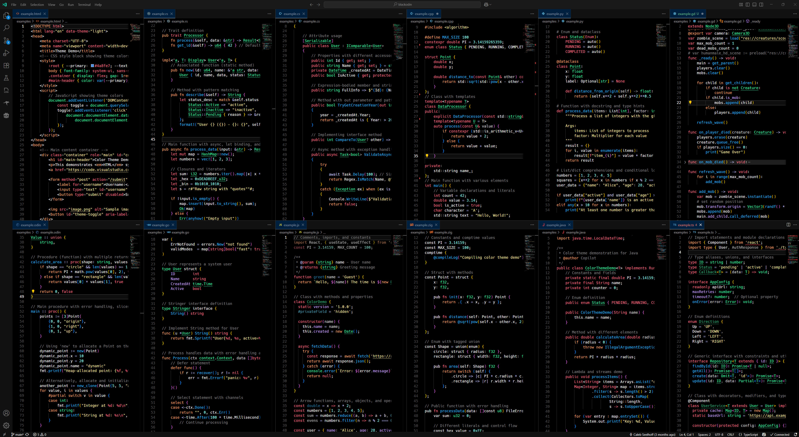

# Black Odin
Black Odin is a higher contrast version of VS Code's Dark+ Theme, with slight modifications for readability and diverse distinguishable colors, specifically written for Odin Language Server.

## Screenshots



## Examples

Check out the [examples directory](./examples) for demo code.

## Compile .vsix Instructions

To compile the .vsix file, run the following command in the root directory of the repository:
```bash
nix-shell --run "npm install --no-audit --no-fund --save-dev vsce && npx vsce package"
```

The .vsix file will be in the root directory of the repository.

## Install .vsix Instructions

To install the .vsix file, open it in VS Code.
